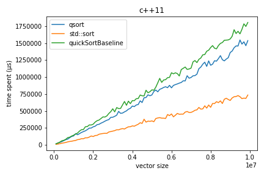
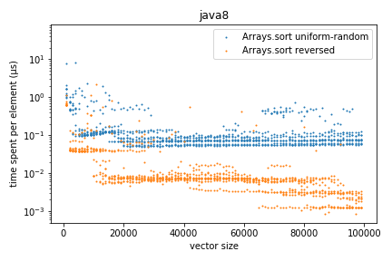
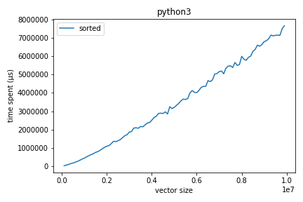

Benchmark sort
=======

The task is to sort a vector/array of (pseudo-)randomly generated integers using standard libraries, and measure the spent time with respect to the vector/array size.

The current (counter-intuitive) observation is that **the complexity of all standard sort algorithms has a O(n) complexity**.

1. I am suspicious about the correctness of my benchmark code, but can't find anything wrong with it (if you do, please point it out in issues!)
2. I am investigating this problem in a slow pace, and will keep this document updated until I know what is going wrong.
3. You are welcomed to try out the benchmark code on your machine, discuss about potential reason why this happened, and maybe even contribute additional experiments!

## C++11

Three algorithms are benchmarked: (1) `std::sort` (2) `qsort` and (3) `quickSortBasline`:

About `std::sort` (from [this post](https://stackoverflow.com/questions/5038895/does-stdsort-implement-quicksort)):

> `std::sort` is most likely to use QuickSort, or at least a variation over QuickSort called IntroSort, which "degenerates" to HeapSort when the recursion goes too deep.

About `qsort`: 

## Java8

From [this post](https://www.quora.com/What-is-the-complexity-of-Arrays-sort-in-java-Also-why-isn%E2%80%99t-it-as-efficient-as-quick-sort-in-C-or-C++):

> It (`Arrays.sort`) uses dual-pivot quicksort for primitives, which though better than a standard quicksort could still degrade into a quadratic running time.

## Python3

From [this post](https://stackoverflow.com/questions/10948920/what-algorithm-does-pythons-sorted-use):

> Python uses an algorithm called Timsort

## Questions

|       | std::sort                                           | Arrays.sort                                                  | sorted                                            |
| ----- | --------------------------------------------------- | ------------------------------------------------------------ | ------------------------------------------------- |
| Best  | ?                                                   | ?                                                            | [O(n)](https://en.wikipedia.org/wiki/Timsort)     |
| Avg   | [O(nlogn)](https://en.wikipedia.org/wiki/Introsort) | ?                                                            | [O(nlogn)](https://en.wikipedia.org/wiki/Timsort) |
| Worst | [O(nlogn)](https://en.wikipedia.org/wiki/Introsort) | [O(nlogn)](https://www.quora.com/What-is-the-complexity-of-Arrays-sort-in-java-Also-why-isn%E2%80%99t-it-as-efficient-as-quick-sort-in-C-or-C++) | [O(nlogn)](https://en.wikipedia.org/wiki/Timsort) |

From our [benchmark](explore.ipynb), it seems that the complexity of all algorithms is O(n), rather than the claimed complexities:

Why?